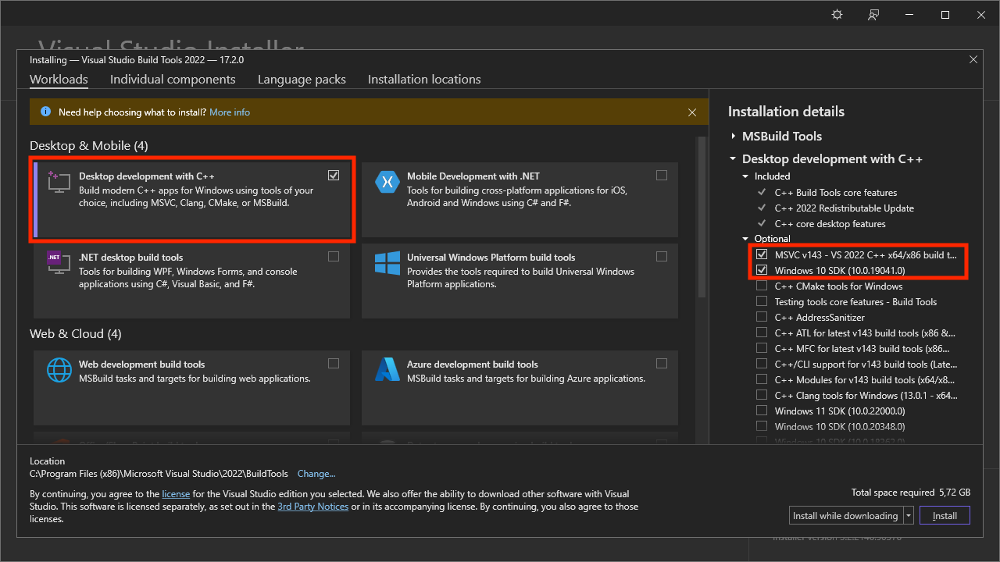

# Reminders App

## Setup Guide (Windows)

This guide is used to run the app in development mode.

### 1. Prerequisites

See [Tauri Prerequisites](https://tauri.app/v1/guides/getting-started/prerequisites) for the most up to date guide.

> _Note: You may need to restart your machine after installing software for it to take effect._

1. Download and Install [Node.js](https://nodejs.org/en/download)

2. Download and Install [Microsoft Visual Studio C++ Build Tools](https://visualstudio.microsoft.com/visual-cpp-build-tools/)

   > _Note: Select the minimum options shown in image below._

   

3. Download and Install [WebView2](https://developer.microsoft.com/en-us/microsoft-edge/webview2/#download-section)

   > _Note: > Windows 10 (Version 1803) has WebView installed as part of the operating system._

4. Download and Install [Rust](https://www.rust-lang.org/tools/install)

### 2. Install App Dependencies

> _Note: Run command from the root directory._

```sh
npm i
```

### 3. Run App in Devleopment Mode

> _Note: Run command from the root directory._

```sh
npm run tauri dev
```
